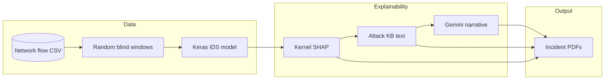

# IDS Explainability System

End-to-end pipeline for **network intrusion detection (IDS) explainability**: load a trained sequence model on flow features, run **blind inference** (no labels fed to the model), compute **Kernel SHAP** on the predicted class, enrich with **static attack-family text** (pseudo-RAG), optionally call **Google Gemini** for an operator-facing narrative, and write **one PDF per predicted attack incident**.

---

## What this project does

| Stage | Description |
|--------|-------------|
| **Sampling** | Random contiguous windows from a CSV using only **numeric feature columns** trained with the model. True labels are never passed to the network. |
| **Inference** | Keras `.keras` model outputs per-class probabilities for each window. |
| **Filtering** | Windows predicted as **BENIGN** skip report generation; **attack classes** trigger explainability. |
| **SHAP** | Kernel SHAP explains the **softmax probability of the predicted class**, aggregating contributions over time steps per feature. |
| **Pseudo-RAG** | `attack_kb.py` supplies short, class-specific reference text (replaceable later with real retrieval). |
| **LLM** | Gemini turns SHAP + probabilities + reference text into plain-language narrative (with retries on rate limits; fallback if disabled or quota exhausted). |
| **Reporting** | Matplotlib builds a high-contrast **incident PDF** per attack prediction under `incident_reports/`. |

---

## Architecture



---

## Repository layout

| Path | Role |
|------|------|
| `test_model.py` | Entry point; calls `nids_explain.pipeline.main`. |
| `nids_explain/pipeline.py` | Orchestrates blind sampling → predict → SHAP → LLM → PDF. |
| `nids_explain/config.py` | Paths, seeds, SHAP/Gemini tuning via environment variables. |
| `nids_explain/core/tf_setup.py` | TensorFlow noise suppression; enables unsafe deserialization for custom Lambda load. |
| `nids_explain/core/env_loader.py` | Loads `.env` into `os.environ` (does not override existing vars). |
| `nids_explain/data/dataset.py` | Resolves dataset CSV path (`DATASET_CSV` or defaults). |
| `nids_explain/data/blind_sampling.py` | Random windows + extra background windows for SHAP. |
| `nids_explain/data/labels.py` | Label utilities (package consistency). |
| `nids_explain/model/loader.py` | Loads `.keras` zip; patches Lambda layer config for deserialization. |
| `nids_explain/explain/shap_attribution.py` | Kernel SHAP on predicted-class probability; top‑k features. |
| `nids_explain/llm/attack_kb.py` | Static per-class attack descriptions + RAG-style headers. |
| `nids_explain/llm/gemini.py` | Gemini init (new `google.genai` or legacy `google.generativeai`), retries on 429, optional `GEMINI_DISABLE`, fallback narrative. |
| `nids_explain/report/incident_pdf.py` | Single-incident PDF layout (verdict banner, SHAP table, reference block, LLM text). |
| `nids_explain/utils/probability.py` | Top‑k class probability strings for reports. |
| `model_artifacts/` | Trained model `.keras`, `label_encoder.joblib`, `scaler.joblib`, `feature_names.joblib`. |
| `fix_assets.py` | Validates artifacts, clears Python caches, optionally deletes generated PDFs. |

---

## Prerequisites

- **Python 3.10+** (project developed with 3.10).
- **GPU optional** — SHAP and inference can be CPU-heavy; TensorFlow will use GPU if configured.

---

## Installation

From the project root (this folder):

```bash
python -m venv .venv
.venv\Scripts\activate   # Windows
# source .venv/bin/activate   # Linux/macOS

pip install -r requirements.txt
```

---

## Configuration

Create a `.env` file in the project root (see `.env.example`). Variables are loaded automatically by `load_local_env()` before the pipeline runs.

### Core

| Variable | Default | Meaning |
|----------|---------|---------|
| `DATASET_CSV` | *(see `dataset.py`)* | Absolute or relative path to the flow-features CSV. If unset, code tries bundled/default paths. |
| `EXPLAIN_SEED` | `42` | RNG seed for reproducible blind windows and SHAP background sampling. |
| `BLIND_SAMPLE_COUNT` | `8` | Number of random windows sampled per run. |
| `WINDOW_ROWS` | `10` | Rows per sliding window (sequence length). |
| `BLIND_BACKGROUND_WINDOWS` | `24` | Extra random windows pooled with blind samples for Kernel SHAP background. |
| `CSV_READ_NROWS` | `800000` | Max rows read from CSV when loading (trim for faster experiments). |
| `INCIDENT_REPORTS_DIR` | `incident_reports` | Output directory for PDFs (relative to project root unless absolute). |

### SHAP

| Variable | Default | Meaning |
|----------|---------|---------|
| `TOP_SHAP_FEATURES` | `10` | How many top \|SHAP\| features to show and send to Gemini. |
| `SHAP_NSAMPLES` | `256` | Kernel SHAP `nsamples`. |
| `SHAP_BG_MAX` | `16` | Max background windows per explained instance (excluding self). |

### Gemini

| Variable | Default | Meaning |
|----------|---------|---------|
| `GEMINI_API_KEY` | — | Required for live LLM text (unless disabled). |
| `GEMINI_MODEL` | `gemini-2.5-flash` | Model id for `generate_content`. |
| `GEMINI_INTER_REQUEST_DELAY_SEC` | `4` | Pause between successive LLM calls in one run (reduces bursts). |
| `GEMINI_MAX_RETRIES` | `8` | Retries on 429 / quota with backoff. |
| `GEMINI_DISABLE` | — | Set to `1`, `true`, or `yes` to skip API calls and use built-in fallback narrative in PDFs. |

Free-tier quotas are tight (e.g. daily request limits per model). See [Gemini rate limits](https://ai.google.dev/gemini-api/docs/rate-limits) and [usage dashboard](https://ai.dev/rate-limit).

### Legacy / housekeeping

| Variable | Meaning |
|----------|---------|
| `REPORT_FILENAME` | Used only by `fix_assets.py` with `CLEAN_REPORTS` for the legacy consolidated PDF name. |
| `CLEAN_REPORTS=1` | With `fix_assets.py`, removes legacy consolidated PDF and `incident_reports/*.pdf`. |

---

## Model artifacts (`model_artifacts/`)

The pipeline expects:

- `iot_model_20260507_171659.keras` — trained Keras model (filename is configured in `config.py`).
- `label_encoder.joblib` — sklearn label encoder (`classes_` order must match training).
- `scaler.joblib` — fitted scaler applied row-wise inside each window.
- `feature_names.joblib` — ordered list of column names used as model inputs.

To use another model export, update `MODEL_FILENAME` (and related filenames) in `nids_explain/config.py` or mirror the same filenames.

---

## Dataset

Provide a CSV whose **feature columns match** `feature_names.joblib`. The label column is **not** fed to the model; sampling uses numeric features only.

Default relative layout in code points at `CICIoT2023/part-00000-363d1ba3-8ab5-4f96-bc25-4d5862db7cb9-c000.csv` if that path exists; otherwise set **`DATASET_CSV`** explicitly.

---

## Running

```bash
python test_model.py
```

Examples:

```bash
set EXPLAIN_SEED=99
set BLIND_SAMPLE_COUNT=4
python test_model.py
```

```bash
set GEMINI_DISABLE=1
python test_model.py
```

---

## Outputs

- **`incident_reports/`** — PDFs named by incident index and predicted class, e.g. `incident_000_<CLASS>_*.pdf`.
- Each PDF includes: predicted class, confidence, top‑3 probabilities, SHAP table, static attack reference text, and Gemini narrative (or fallback text).

---

## Utility: `fix_assets.py`

Validates that required files exist under `model_artifacts/`, checks the `.keras` archive contains `config.json`, clears `__pycache__` / `.pyc`, and optional test caches.

```bash
python fix_assets.py
```

To also delete generated PDFs:

```bash
set CLEAN_REPORTS=1
python fix_assets.py
```

---

## Security note on secrets

**Do not commit `.env` or API keys.** If a key was ever pushed to a remote, rotate it in [Google AI Studio](https://aistudio.google.com/) or your Cloud project and use repository secrets / local `.env` only.

---

## Extending the project

- **Real RAG**: Replace `get_attack_context()` data source with retrieval over your corpus; keep the same function signature.
- **Different LLM**: Add a sibling module to `gemini.py` and swap the call in `pipeline.py`.
- **Batching**: Reduce `BLIND_SAMPLE_COUNT` or attack-only filtering to limit PDF and Gemini calls.

---

## Troubleshooting

| Issue | What to try |
|-------|-------------|
| `Dataset CSV not found` | Set `DATASET_CSV` to a valid path. |
| Gemini `429` / quota | Wait for quota reset, enable billing, switch `GEMINI_MODEL`, reduce samples, or `GEMINI_DISABLE=1`. |
| Model load errors | Run `fix_assets.py`; ensure `tf_setup` is imported before load (handled by `pipeline.py`). |
| Empty incident PDFs folder | All sampled windows predicted BENIGN — increase `BLIND_SAMPLE_COUNT` or change `EXPLAIN_SEED`. |

---

## Author & upstream

Repository: [Explainability-System](https://github.com/MuhamedElockly/Explainability-System) (configure `origin` if you fork or mirror).

This codebase targets **production-style IDS explainability** coursework and demos: transparent features, SHAP grounded in the actual model output, and human-readable reporting for operators.
