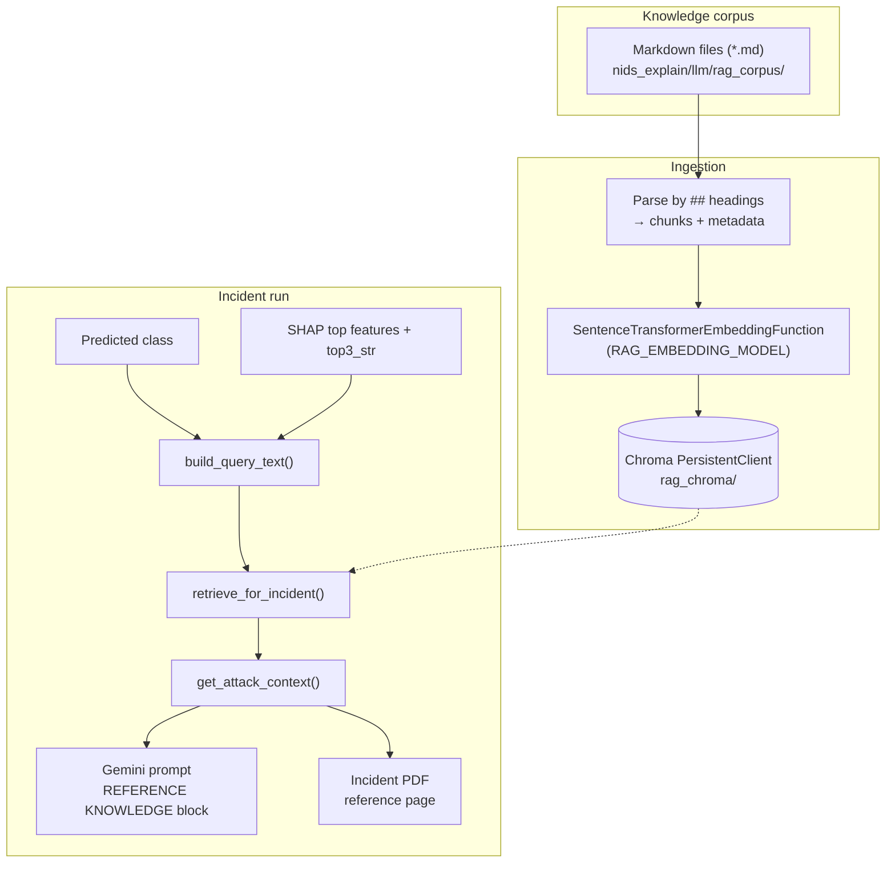

# Retrieval-Augmented Generation (RAG) in the IDS Explainability System

This document describes **how RAG works in this repository**: where knowledge lives, how text is **chunked**, which **embedding model** is used, how **Chroma** stores vectors, how **queries** are built from model outputs, and how retrieved text is merged into the **Gemini** prompt.

---

## 1. Purpose of RAG here

The trained IDS model predicts a **coarse attack family** from **flow-feature windows** alone. Kernel **SHAP** explains *which features* pushed that prediction. **RAG adds external, human-readable cyber context**: typical behaviors, distinctions between families, and analyst-style cautions grounded in curated text—not hallucinated prose.

Together:

| Piece | Role |
|--------|------|
| **Model + SHAP** | What the model relies on numerically *for this window* |
| **RAG chunks** | What that label *generally means* in security language |
| **Gemini** | Bridges SHAP numbers + retrieval into an operator-facing narrative |

RAG does **not** replace SHAP or ground truth labels; it **grounds vocabulary** and expected patterns while the instructions stress staying aligned with SHAP.

---

## 2. Architecture (high level)



---

## 3. Corpus location and authoring

### 3.1 Directory

All source knowledge lives under:

```text
nids_explain/llm/rag_corpus/
```

Each **attack coarse class** the model knows has a Markdown file whose **basename** maps to metadata `attack_family` (must match filenames below):

| File stem | Stored `attack_family` |
|-----------|-------------------------|
| `benign.md` | `BENIGN` |
| `brute_force.md` | `BRUTE_FORCE` |
| `ddos.md` | `DDOS` |
| `dos.md` | `DOS` |
| `mirai.md` | `MIRAI` |
| `recon.md` | `RECON` |
| `spoofing.md` | `SPOOFING` |
| `web_attack.md` | `WEB_ATTACK` |

Files with other names under that folder are **ignored** unless you extend `_FILENAME_TO_FAMILY` in `nids_explain/llm/rag_engine.py`.

### 3.2 Top-level title lines (`# ...`)

Lines starting with a single `#` are treated like normal prose in the **first section** (“Introduction”). They do **not** start a new chunk by themselves—the chunking rule is **`##`-only**.

---

## 4. Chunking technique (detailed)

Chunking is **not** sliding-window or fixed token count. It is **Markdown section chunking**:

1. Each `*.md` file is read as UTF-8 text.
2. The parser scans **line by line**.
3. A line matching **`## Some heading`** starts a **new chunk boundary**:
   - The previous accumulated lines (if non-empty after trim) become the **body** of the chunk whose **heading** was the prior section title (or **`Introduction`** for text before the first `##`).
4. Content under that `##` line accumulates until the next `##` or end-of-file.

So **each `##`-delimited section = one retrieval unit** at ingest time.

### 4.1 What gets embedded (document string)

For each `(heading, body)` pair, the text actually stored as the **Chroma document** (and embedding input) is **not** the raw section alone. The code prefixes explicit context:

```text
Attack coarse class: <FAMILY>. Section: <heading>.

<body>
```

**Why:**

- Embedding models behave best when the vector represents a **standalone semantic unit**.
- Putting the coarse class name and section title inside the embedding text aligns the vector space with **filter predicates** (`where: attack_family`) and improves similarity when queries mention the predicted family.

Chunk **IDs** look like `{file_stem}-{slugified_heading}`—for example `ddos-operational-overview` style strings—built in `_parse_markdown_corpus()` (`nids_explain/llm/rag_engine.py`).

### 4.2 Metadata per chunk

Each chunk carries Chroma metadata (used for filtering, not embedding):

| Metadata key | Meaning |
|----------------|---------|
| `attack_family` | Coarse IDS label string, e.g. `DDOS` |
| `section` | Heading text (truncated to 200 chars for storage hygiene) |

### 4.3 What this chunking deliberately avoids

- **No overlapping windows** across sections (no 50%-overlap token splitter).
- **No recursive character splitting** (à la LangChain’s `RecursiveCharacterTextSplitter`).
- **No fixed character budget**—section length varies; if a section grows very long, embeddings may internally truncate according to the model’s tokenizer (see §5).

Operational trade-off: authoring stays simple and readable; unusually long sections can be split by adding more `##` subsections to keep chunks focused.

---

## 5. Embedding model

### 5.1 Default model identifier

Controlled by **`RAG_EMBEDDING_MODEL`** in `nids_explain/config.py` (environment override supported).

Default:

```text
all-MiniLM-L6-v2
```

Implemented via:

```python
chromadb.utils.embedding_functions.SentenceTransformerEmbeddingFunction(model_name=RAG_EMBEDDING_MODEL)
```

(**Source:** `nids_explain/llm/rag_engine.py`, function `_get_embedding_fn()`.)

### 5.2 What kind of model this is

- **Family:** Sentence Transformer (sentence-level dense embeddings derived from MiniLM distillations of BERT-style encoders).
- **Output:** A **fixed-dimensional** dense vector per input string. For **`all-MiniLM-L6-v2`**, the embedding dimensionality is **384** (sentence-transformers / model card semantics).
- **Training intuition (high level):** These checkpoints are pretrained and fine-tuned on semantic similarity / retrieval-style objectives so **paraphrases and topical matches** score closer in cosine space than unrelated text.

### 5.3 Why this default was chosen

- **Local inference** (no paid embedding API required for RAG to work).
- **Fast cold start** relative to large cross-encoders.
- **Good enough** for short operational paragraphs and keyword-rich security prose when combined with **metadata filtering** on `attack_family`.

### 5.4 Upgrading embeddings

Swap `RAG_EMBEDDING_MODEL` to another [Sentence Transformers model](https://www.sbert.net/docs/pretrained_models.html), then rebuild the store (**§7**). Heavier models improve nuance but cost CPU/GPU RAM and ingestion time.

---

## 6. Vector database: Chroma

### 6.1 Persistence

Chroma runs as **`PersistentClient`** with path:

| Config | Env var | Default |
|--------|---------|---------|
| `RAG_PERSIST_DIR` | `RAG_PERSIST_DIR` | `rag_chroma/` under project root |

The folder is gitignored—each machine/materialization rebuilds or copies it.

**Collection name:** `nids_attack_corpus` (`rag_engine._COLLECTION_NAME`).

### 6.2 Index similarity space

Collection metadata includes:

```text
"hnsw:space": "cosine"
```

So retrieval ranking uses **cosine distance / similarity semantics** compatible with normalized sentence embeddings.

### 6.3 Embedding side vs query side

- **At ingest:** each chunk document is embedded once and stored with its id + metadata.
- **At query:** Chroma embeds **`build_query_text()`** output with the **same embedding function instance** wired to `get_collection` / `create_collection`, so query and corpus live in **one embedding space**.

---

## 7. When ingestion runs and versioning

`_ensure_bundle()` in `rag_engine.py` orchestrates lazily-on-first-retrieval initialization:

### 7.1 Corpus fingerprint

Before trusting an existing DB, code computes **`corpus_fingerprint()`**:

- Sorted list of **`rag_corpus/*.md` files**
- For each file, feed **filename + raw bytes** into **SHA-256**, then keep a truncated hex digest (configured length in source).

Changing **any corpus file** normally changes this fingerprint → triggers **collection recreate** (delete + add), unless you’ve forced a path that skips it incorrectly (see stored fingerprint file below).

### 7.2 Sidecar fingerprint file

Path: `rag_chroma/corpus_fingerprint.txt` (under `RAG_PERSIST_DIR`).

If the text inside does not match the live corpus hash, the collection is rebuilt.

### 7.3 Force rebuild

Environment:

```text
RAG_FORCE_REBUILD=1
```

(or `true` / `yes`)

Deletes the collection (best effort) before re-ingest—use after **embedding model swaps** even if fingerprints matched, because vectors are not backward compatible across unrelated models.

---

## 8. Query construction (critical for retrieval quality)

Pure “predicted class only” retrieval is weak: it ignores what made *this window* special.

The implementation builds a **pseudo-document query string** combining:

### 8.1 Global framing

Fixed phrase:

```text
Network intrusion detection flow-feature window explanation.
```

### 8.2 Predicted family

Uppercased coarse class:

```text
Predicted coarse class / attack family: DDOS.
```

(example)

### 8.3 Top-3 probabilities string

From the pipeline artifact `event["top3_str"]` — gives the LM (and embeddings) cues about confusion between families.

### 8.4 SHAP feature names

First **`RAG_QUERY_TOP_SHAP`** entries from `event["shap_top_features"]` (dict rows with `"feature"` key), each rendered as:

```text
Important flow feature name for this window: Flow Duration.
```

(**Default `RAG_QUERY_TOP_SHAP`:** configurable in config; typical default `8`.)

Jointly this steers cosine neighborhoods toward corpus passages that mention **similar mechanisms** when your corpus aligns language with plausible feature semantics.

Implementation:** `build_query_text()` (`rag_engine.py`).

---

## 9. Retrieval strategy (two-stage merge)

Controlled by **`RAG_TOP_K`** and **`RAG_TOP_K_FILTERED`** (`config.py`; env overrides).

Parameters:

| Setting | Typical role |
|---------|----------------|
| `RAG_TOP_K_FILTERED` | First query: **`where={"attack_family": predicted}`** — focuses on passages tagged for that IDS label |
| `RAG_TOP_K` | Desired **final count** merged into the prompt |

Procedure (`retrieve_for_incident()`):

1. **Filtered query**: `collection.query(..., n_results=k_filtered, where={attack_family=fam})`.
2. Dedupe ids into `merged`.
3. If fewer than **`RAG_TOP_K`** chunks, run a **second unfiltered query** with `n_results ≈ k_total + k_filtered`, walk results in order, append unseen ids until `k_total` or exhaustion.

**Why two stages:** metadata filter prevents pulling DDOS lore when spoofing dominates semantically ambiguous queries; widening fills shortfalls if taxonomy mismatch or embeddings blur families.

Returned list items include `rank`, chunk `id`, `section`, and full **`text`** (the prefixed embed string).

---

## 10. Prompt assembly and truncation

### 10.1 Formatting retrieved chunks for Gemini

`format_chunks_for_prompt()` wraps each chunk with:

```text
[Source rank N: chunk_id=... · section=... ]
<embedding text body>
...
---
```

Separate chunks concatenated by horizontal rule-like divider `---`.

### 10.2 `attack_kb.py` responsibilities

`get_attack_context(predicted_class, event)` (`nids_explain/llm/attack_kb.py`):

- Honors **`RAG_DISABLE=1`**: returns **`static_attack_paragraph()`** dictionary blurbs (**no embeddings / no disk I/O load** path).
- On success retrieves via `retrieve_for_incident()` + formatter.
- Truncates to **`RAG_PROMPT_MAX_CHARS`** (default bounded; `0` could mean unlimited if you patched logic—currently positive default in config) noting truncation in-banner text appended when cut.

### 10.3 `rag_header()` (LLM behavioral instructions)

Injects Gemini instructions: treat chunks as corpus knowledge, reconcile with SHAP cautiously, no unsupported packet forensic claims.

### 10.4 Where it lands in Gemini

`nids_explain/llm/gemini.py` injects **`rag_header()`** plus `REFERENCE KNOWLEDGE` section before probabilities + JSON SHAP—so the causal order is:

1. Task framing (“SOC analyst”).
2. RAG grounding.
3. Numeric model outputs.
4. Explanation instructions.

Incident PDF renders the same grounding string (**truncated visually** separately via **`RAG_PDF_CONTEXT_MAX_CHARS`** in PDF writer).

---

## 11. Fallbacks and resilience

| Condition | Behavior |
|-----------|----------|
| `RAG_DISABLE=1` | Static short paragraph per coarse class (`attack_kb.static_attack_paragraph`) |
| Chroma ingestion / corpus missing / transient errors | Silent fallback inside `try/except`: static paragraph (**no surfaced exception**) so pipeline completes |
| `GEMINI_*` outages | Separate Gemini fallback narrative (still references reference knowledge expectation in PDF wording) |

For debugging RAG silently falling back **temporarily instrument** locally (avoid logging secrets)—e.g., print exception in except during development builds only.

---

## 12. Environment variables summary

Defined in **`nids_explain/config.py`**:

| Env var | Typical purpose |
|---------|----------------|
| `RAG_PERSIST_DIR` | Chroma path |
| `RAG_EMBEDDING_MODEL` | Sentence Transformer id |
| `RAG_TOP_K` | Final chunk count target |
| `RAG_TOP_K_FILTERED` | Filtered-phase cap |
| `RAG_QUERY_TOP_SHAP` | SHAP-derived query expansion depth |
| `RAG_PROMPT_MAX_CHARS` | Hard cap character budget for Gemini block |
| `RAG_FORCE_REBUILD` | Force recreate collection |
| `RAG_DISABLE` | Skip vector retrieval entirely |

`RAG_PDF_CONTEXT_MAX_CHARS` limits printed PDF verbosity (different from Gemini cap).

Also see `.env.example`.

---

## 13. Design limitations (honest checklist)

What this RAG pipeline **does not** currently include:

- **Hybrid BM25 + dense fusion** — pure semantic + filtering.
- **Cross-encoder re-ranking** after initial ANN retrieval.
- **Citation enforcement** enforcing each LLM clause map to cited chunk spans.
- **Automatic evaluation** suite (Recall@k, nDCG) over labeled queries.

These are plausible upgrades while keeping authored Markdown chunking conventions.

---

## 14. File map (quick reference)

| File | Responsibility |
|------|------------------|
| `nids_explain/llm/rag_engine.py` | Parse corpus, ingest Chroma, query, format |
| `nids_explain/llm/attack_kb.py` | Toggle + truncation + Gemini header helpers |
| `nids_explain/llm/rag_corpus/*.md` | Source knowledge authored by humans |
| `nids_explain/pipeline.py` | Builds `event` then passes into `get_attack_context` |
| `nids_explain/llm/gemini.py` | Stitch RAG context into Gemini prompt |

---

## 15. Glossary

| Term | Meaning here |
|------|--------------|
| **Chunk** | One `##` section (plus synthesized prefix metadata string) indexed as single document vector |
| **Coarse family** | One of encoder classes (`DDOS`, `RECON`, …) aligning with corpus metadata |
| **Metadata filter** | Chroma constraint limiting initial ANN lookup to labeled family |
| **Query expansion** | Augment textual query beyond label using SHAP + top-3 string |

---

*Document version aligns with codebase structure as of authoring; tweak defaults if environment variables drift.*
